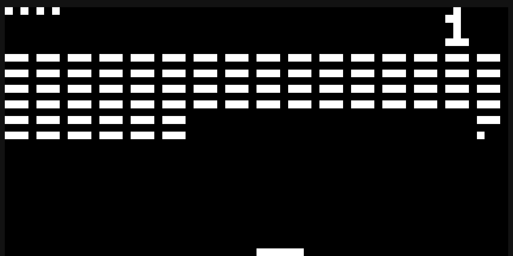
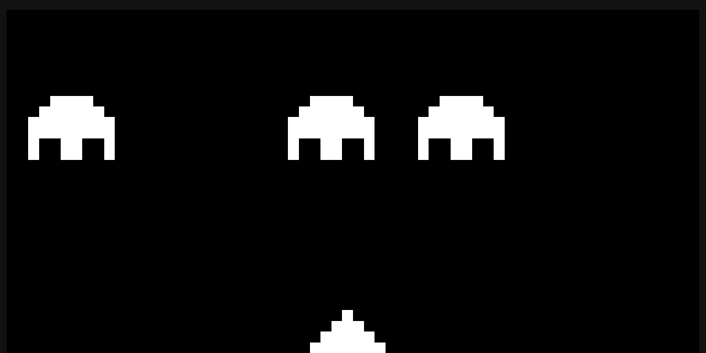
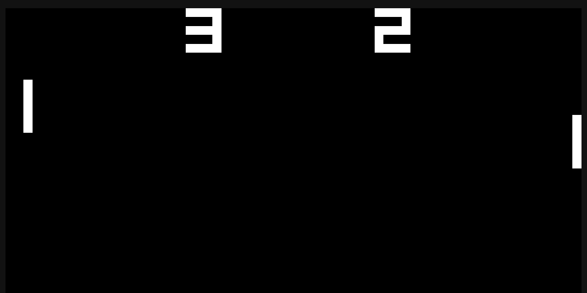

# Chip-8 Emulator

A [Chip-8](https://en.wikipedia.org/wiki/CHIP-8) emulator written in Rust. Uses webassembly and typescript for web. Uses sdl2 for desktop app.

## Games

### BRIX

#### Controls

- q = left
- e = right

### INVADERS

#### Controls

- q = left
- w = shoot
- e = right

### PONG

#### Controls

- 1 = left paddle up
- q = left paddle down
- 4 = right paddle up
- r = right paddle down

### TETRIS

#### Controls

- q = rotate
- w = left
- e = right
- a = accelerate down

